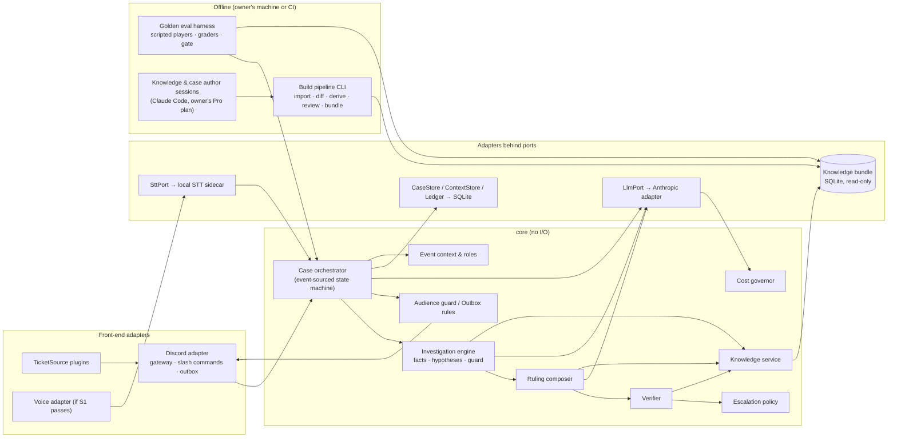
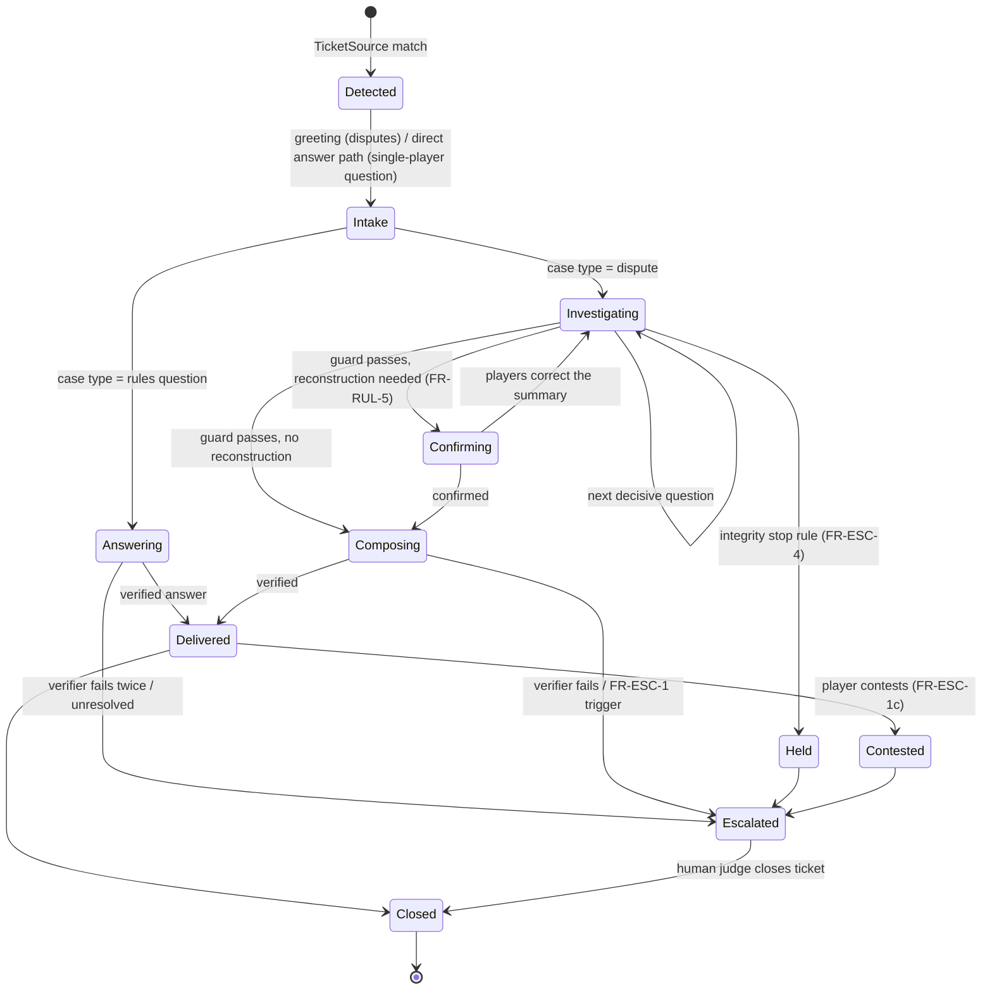

# AI MTG Judge: Architecture v1

Status: Proposed (PR `arch/v1`) · Date: 2026-09-25 · Author: architect role (Claude) · Approver: Frank (product owner)

This document turns [`docs/PRD.md`](../PRD.md) into a technical design. It does not change any requirement. Where the PRD is silent or unclear, the gap is raised as an open question in PRD §12 (OQ-22 onwards). Decisions are recorded in [`adr/`](adr/README.md). The other deliverables are:

- [SEQUENCE.md](SEQUENCE.md): one judge call, end to end;
- [SPIKES.md](SPIKES.md): the three technical spikes;
- [TRACEABILITY.md](TRACEABILITY.md): every FR and NFR mapped to components.

## 1. Design drivers

| Driver | Source | What it forces |
| --- | --- | --- |
| Deterministic first, AI last; spend at build time | P2 | Lookups, penalties, procedures, and citations are data in a bundle. The model only understands, selects, and words. |
| $0.05–0.10 per case, all in | NFR-COST-1 | Cheap models for most turns, caching, no extra hosting cost, a cost governor |
| 100% of easy cases correct; no invented citations; `UNRESOLVED` is valid | NFR-ACC-1..3, FR-RUL-9 | A deterministic guard before ruling, a verifier after, and citations restricted to retrieved IDs |
| Multiplayer from day one | §4, R3 | Seats are an ordered list of N. Procedures address roles (`activePlayer`, `opponentFurthestFromActive`), never "the opponent". |
| Protected information | FR-ESC-4, D6 | Typed audiences; the model writing to players never sees protected content |
| Existing ticket bot, pluggable | FR-INT-1, D37, R13 | A `TicketSource` plugin |
| Pick up tickets opened during an outage | NFR-AVAIL-1 | Event-sourced cases and reconciliation on startup |
| Don't rule out the phone app, WhatsApp, vision, on-device inference, languages, or scale | D31, §4, NFR-EXT-1 | Ports and adapters; an I/O-free `core`; a portable SQLite knowledge bundle; locale catalogs |
| Provider replaceable | D41, NFR-TECH-1 | `LlmPort` with task roles; models chosen in config |

## 2. Components



| Component | Package | Responsibility | ADR |
| --- | --- | --- | --- |
| **Discord adapter** | `adapters/discord` | Gateway connection, intents, turning Discord events into `InboundMessage{caseRef, author→seat, modality, text, attachments}`, slash commands (`/judge context …`, `/judge admin …`, `/judge export`, `/judge doctor`), and sending from the Outbox with idempotency keys | 0010, 0011 |
| **TicketSource plugins** | `adapters/discord/tickets` | Detect, parse, list, and track closure of the existing ticket bot's containers | 0010 |
| **Voice adapter** | `adapters/discord/voice` | Only if spike S1 passes: listening window, consent, per-user audio to `SttPort` | 0015 |
| **Case orchestrator** | `core/engine` | Owns the case lifecycle (§5.1). Folds `CaseEvent`s into state. Runs the per-case queue. Calls the other `core` components in order. Handles catch-up. | 0011 |
| **Investigation engine** | `core/engine` | Claims → facts (with origin), disputes, hypothesis set, decisive-fact computation, next-question candidates, the ruling guard | 0008 |
| **Ruling composer** | `core/engine` | Builds the `Ruling`: the `reason` role supplies the chain and explanation; the penalty table and procedure supply the penalty and fix; picks the delivery pattern | 0008 |
| **Verifier** | `core/engine` | Deterministic checks on every ruling and answer before it reaches players (§5.6) | 0008 |
| **Escalation policy** | `core/engine` | Evaluates FR-ESC-1 (a)–(e), builds the handoff package, runs the stop rule | 0008, 0009 |
| **Audience guard** | `core/engine` | Typed audiences, player-safe projection for prompts, output lint | 0009 |
| **Knowledge service** | `core/knowledge` | Read-only queries on the bundle: section by ID, card resolver, concept index, cross-references, FTS, penalty table, procedures, glossary, mnemonics, locale catalogs | 0005, 0006, 0007 |
| **Event context & roles** | `core/context` | Event contexts, share codes, Admin → TO role mapping per server, permission checks | — |
| **Cost governor** | `core/cost` | Ledger, per-case ceiling, degradation ladder | 0012 |
| **LlmPort / Anthropic adapter** | `adapters/anthropic` | Task-role routing, structured outputs, caching, usage reporting | 0002 |
| **SttPort / STT sidecar** | `adapters/stt` | Local transcription on the host GPU (no cloud STT in the MVP) | 0015 |
| **Stores** | `adapters/sqlite` | Runtime database: cases (event log), contexts, ledger, retention job | 0004 |
| **Build pipeline** | `pipeline` | Deterministic: import, diff, export work packets, validate returned drafts, review queue, bundle, release report | 0007, 0016 |
| **Knowledge author / case author** | Claude Code sessions | AI drafting of procedures, penalty rows, concept tags, and mnemonics; writing golden cases. Runs on the owner's Pro subscription. | 0013, 0016 |
| **Eval harness** | `eval` | Golden replay with scripted players, graders, variant generation, and the release gate. Model calls go through the eval-only subscription adapter. | 0013, 0016 |
| **App** | `app` | Composition root: wires adapters into `core` from config | 0001 |

**Dependency rule:** `core` depends only on its own port interfaces. Adapters depend on `core`. Nothing in `core` imports Discord, Anthropic, SQLite, or Node-only APIs (ADR-0001). That is what makes a new front end, provider, or storage an adapter-level change.

## 3. Data model

TypeScript-flavoured sketches. The field names are guidance for the planner, not a frozen schema.

### 3.1 Knowledge (build time, read-only at run time)

```ts
SourceDocument { docId, title, version, effectiveDate, origin: {url} | {manualTranscript: {by, on}},
                 retrievedAt, contentHash }
Section        { sectionId /* "CR:603.3b", "IPG:2.1", "MTRA:hidden-card-error" */, docId, number,
                 title?, text, parentId?, order, textHash, refs: SectionId[], concepts: ConceptId[] }
Card           { oracleId, name, aliases[], manaCost?, typeLine, oracleText, faces?[], colorIdentity[],
                 rulings: { date, text, source: "wotc" }[], dataVersion }
Concept        { conceptId, label(i18n), coreSections: SectionId[], mnemonicId?, derivation }
Mnemonic       { mnemonicId, conceptId, text(i18n), sourceSections[], approvedBy, approvedOn }   // FR-Q-4
PolicyFramework{ frameworkId /* "IPG-MTR", "IPG-MTR+MTRA@2025-06-24", "IPG-MTR+ADD-PT@…" */,
                 baseDocs: ["MTR","IPG"], addendum?: docId, edits: AddendumEdit[] }            // OQ-20
Infraction     { infractionId /* "GPE-MT" Missed Trigger, "GPE-HCE", … */, category, name,
                 definitionSections[], frameworkAvailability[] }
PenaltyRow     { frameworkId, infractionId, basePenalty /* "No Penalty" | "Warning" | "Turn Skip" | … */,
                 upgradePath?, downgradeNote?, sourceSections[] }                               // FR-POL-1
Procedure      { procedureId, frameworkId, infractionId, facts: FactSpec[], branches: Branch[],
                 stop: StopRule[], sourceSections[], derivation: "ai-draft"|"reviewed" }      // FR-INV-1, ADR-0008
GlossaryTerm   { term, docId, sectionId }                                                       // NFR-I18N-1
BundleManifest { bundleVersion, pipelineVersion, builtAt, docs: {docId, version, hash}[],
                 cardData: {updatedAt, hash}, precedence: LayerId[] /* OQ-4 */, approvedBy?, approvedOn? }
```

### 3.2 Event context and roles (runtime)

```ts
EventContext { eventId, guildId, name, format: "cEDH", rel: "Competitive", frameworkId, language: "en",
               judgeRoleId, toRoleId, judgeOnlyChannelId, playerChannelIds[],
               ticketSource: { id, config },               // ADR-0010, OQ-21/22
               shareCode,                                  // FR-CTX-4: a join code, used with /judge join <code> (owner, 2026-09-25)
               escalation: { confidenceThreshold, alwaysEscalate: CategoryId[] },   // OQ-7
               budget: { payer: "owner" | "to-key" } , createdBy, updatedAt }
GuildRoleMapping { guildId, toRoleId, setByAdminUserId }   // FR-ADM-1, D40
```

Format, REL, and framework are IDs looked up in the bundle, never enums hard-coded in the engine (NFR-EXT-1).

### 3.3 Case (runtime, event-sourced, 7-day retention)

```ts
Case         { caseId, eventId | null, containerRef, openedAt, closedAt?, status, systemVersion, bundleVersion }
Participant  { caseId, seat: "P1".."Pn" | "judge" | "to", discordUserId, displayNameAtOpen, isReporter }
Seating      { order: Seat[], activeSeat?, eliminated: Seat[] }          // only filled when a procedure asks (FR-INV-3)
CaseEvent    { caseId, seq, at, type, payload, systemVersion, bundleVersion }   // ADR-0011

Claim        { claimId, bySeat, text, kind: "event"|"state"|"assertion", messageRef }   // FR-RUL-4
Fact         { factId /* procedure FactSpec id or ad-hoc */, value, origin: "reported"|"observed"|"derived",
               basis: { claimIds[] } | { evidenceId } | { sections[], computation },
               confirmedBy: Seat[] }
Dispute      { factId, versions: { value, bySeat[] }[], status: "open"|"resolved-by-judgement"|"immaterial"|"escalated",
               judgementBasis?: FactId[] }                                          // FR-RUL-2
Evidence     { evidenceId, kind: "text"|"voice-transcript"|"image"|"stream-observation", ref }  // D31
Hypothesis   { hypId, kind: "infraction"|"rules-question"|"integrity", procedureId?, status: "live"|"dropped",
               supporting: FactId[], contradicting: FactId[], note }               // FR-RUL-6
QuestionAsked{ factId, hypIds[], whyItMatters, audience, askedSeat, messageRef }   // FR-INV-2
Ruling       { outcome: "ruling"|"answer"|"unresolved"|"escalated", decision, fixSteps[], penalty?: PenaltyRow & { label: "base, assuming no earlier infractions" },
               chain: { source: SectionId | CardRef, proposition, consequence }[],   // PRD §8
               explanation, deliveryPattern, confidenceSignals, verifier: VerificationResult }
InvestigationNote { signals[], inconsistencies[], suggestedQuestions[] }          // FR-ESC-4, staff-only
Handoff      { summary, established: Fact[], disputed: Dispute[], citations[], provisionalReading, reason }   // FR-ESC-3
```

### 3.4 Golden case

See ADR-0013. It is the same vocabulary as the runtime (`FactSpec` IDs, `branchId`, `SectionId`), so the graders compare like with like.

## 4. Build pipeline versus runtime

| | Build pipeline (offline) | Runtime (always on) |
| --- | --- | --- |
| Runs | Manually, on a new source version (D25), or when artifacts change | 24/7 on the host |
| Inputs | CR, MTR, IPG, addenda, Scryfall bulk, locale sources | Discord events; knowledge bundle |
| AI use | Heavy, but outside the pipeline code: knowledge author sessions in Claude Code draft concept tags, procedures, penalty rows, addendum edits, mnemonics, and glossary checks from exported work packets | Light: Haiku 4.5 / Sonnet 5 for `understand`, `investigate`, `reason`, `phrase` |
| Output | `knowledge-<v>.sqlite`, diff report, release report, stale-case list | Case logs, Discord messages, handoffs, ledger |
| Human step | Owner reviews diffs and AI drafts (OQ-27) and approves the release (FR-BUILD-3) | Human judges take handoffs |
| Paid by | The owner's Claude Pro subscription: no paid API spend, bounded by the plan's usage limits (owner, 2026-09-25; ADR-0016) | Anthropic API credits, $20 a month cap |

Pipeline stages: `import → normalise → diff → export work packets → (knowledge author drafts in Claude Code) → validate (schema, every sourceSection resolves, every infraction has a penalty row per framework, every branch cites a section) → review queue → bundle → eval (ADR-0013) → release report → owner approval → promote`.

## 5. Runtime behaviour

### 5.1 Case lifecycle



- **No event context in the server (FR-CTX-2):** only the `Answering` path is available. A dispute gets a catalog reply saying the judge can't rule on penalties here, and that a human judge should be called.
- The **case type** comes from the `understand` role (rules question versus dispute), with a deterministic override: a ticket naming more than one player, or asking about something that already happened in a game, is treated as a dispute. The AI may downgrade that to a rules question only if no infraction hypothesis survives.

### 5.2 One turn

1. The inbound message is appended as `MessageReceived`, with its author mapped to a seat.
2. **`understand`** (Haiku) turns the message into claims, card mentions, concept tags, and case-type hints.
3. The **card resolver** runs. On any ambiguity the engine asks which card is meant (FR-Q-2) before going further.
4. **Investigation engine** (deterministic) updates facts, disputes, and hypotheses, then computes the decisive unknown facts (ADR-0008).
5. If the guard is not satisfied, **`investigate`** (Haiku) picks and words the next question from the candidates. The engine records `QuestionAsked`, and the outbox sends it to the right audience.
6. If the guard is satisfied, the engine confirms its understanding when that's required (FR-RUL-5). Then **`reason`** (Sonnet) builds the chain from the retrieved sections, and the engine fills the penalty and fix.
7. The **verifier** runs (§5.6). Then the **escalation policy** runs (§6).
8. **`phrase`** (Haiku) renders the result in the delivery pattern and at the depth rule (FR-Q-5: minimum explanation during a game). The output lint runs, then the outbox sends.

### 5.3 Rules questions (FR-Q-1..5)

Retrieval runs in the ADR-0005 order. `reason` receives only the retrieved sections, the Oracle text, and the rulings, and may cite only those IDs. For a concept with an approved mnemonic, the answer leads with the mnemonic and cites only the sections that decide this particular case (FR-Q-4 AC). The full chain is kept in the case log and shown if the player asks "why?" or "citations?". Questions about MTR procedure, such as "how many points is a draw worth?", are answered from the text and never applied to real event data (FR-Q-3, NG1).

### 5.4 Disputes and the hybrid investigation (D29)

See ADR-0008 for the mechanism. Two golden scenarios show why it is built this way.

- **Wheel of Fortune / Flare / Smothering Tithe:** the player's claim "28 missed triggers" becomes `Claim{assertion}`. The trigger count is a `derived` fact computed from the opponents still in the game, which is `observed` if the players stream the table: the procedure's `evidenceHint`. The Missed Trigger procedure's branch predicate depends on whether the stack became empty. That makes `stackBecameEmpty` the one decisive unknown, so the engine asks about the flash casts and the empty stack, and nothing else.
- **The One Ring / Carpet of Flowers:** the objective Missed Trigger branch is decided from game actions (Player 2 let a targeting action proceed). An integrity hypothesis is opened in parallel. It writes only to `InvestigationNote`s, and questioning stays neutral (ADR-0009). The new explanation lowers the integrity hypothesis but does not change the Missed Trigger branch (FR-RUL-6 AC, FR-RUL-7).

### 5.5 Penalties (FR-POL-1..3)

- The penalty comes from a `PenaltyRow` lookup by `(frameworkId, infractionId)`. The model never chooses it.
- The FR-POL-1 AC works like this: the MTRA framework's rows replace Game Loss with Turn Skip on the Deck Problem upgrade path, as data.
- Every penalty is labelled as the base penalty, assuming no earlier infractions, and a copy goes to `Staff` (FR-POL-3).
- The **delivery pattern** (FR-POL-2) is picked in two steps. First a deterministic default comes from the branch (`deliveryDefault`) and the severity. Then the `phrase` role may pick another of the five patterns only by giving a reason, which is recorded. The golden graders compare the chosen pattern with the expected one.

### 5.6 Verifier

It runs on every ruling and answer. All checks are deterministic.

| Check | Requirement |
| --- | --- |
| Every `chain.source` resolves to a section or card in the loaded bundle | NFR-ACC-3 |
| Every cited ID was in this turn's retrieval set (no citing from memory) | §5, NFR-ACC-3 |
| The penalty equals the table lookup; the fix steps equal the branch's steps | FR-POL-1 |
| Every decisive fact of the chosen branch is established; each judgement call lists the facts it rests on | FR-INV-2, FR-RUL-2 |
| No claim with `kind: assertion` is used as a fact | FR-RUL-4 |
| The chain is non-empty for every material step; a missing link gives `UNRESOLVED` | FR-RUL-3, FR-RUL-9 |
| Player-facing text passes the output lint (protected terms, hidden information) | FR-ESC-4, FR-RUL-8 |
| Glossary terms are kept in English | NFR-I18N-1 |

A semantic "does this section really support this proposition" check is **not** a runtime step in v1, for cost reasons. It runs in the eval harness on every golden case. If spike S3 shows there's room in the budget, it can become a runtime check for the `reason` role on hard cases.

**Play advice (FR-RUL-8)** is prevented at three points:

- the `reason` and `phrase` prompts;
- a lint on the reply: suggestions of the form "you should" or "your best line" are blocked;
- golden cases such as Underworld Breach / LED, which specifically test that an answer contains no play advice.

## 6. Escalation, handoff, and protected information

- **Triggers (FR-ESC-1):** the escalation policy checks each of (a)–(e) at the end of every turn:
    - (a) the confidence signals are below the threshold (ADR-0008 §Confidence; OQ-7);
    - (b) the category is on `alwaysEscalate`;
    - (c) the `understand` role marks a message as contesting the ruling. Contesting is detected by the model but *confirmed* with a catalog question ("Would you like me to call a human judge to review this?"), so a misread doesn't escalate by accident;
    - (d) the integrity stop rule fired;
    - (e) a decisive dispute remains open and the two versions select different branches.
- **Before escalating (FR-ESC-2):** the engine asks any remaining candidate questions whose `FactSpec.cheapToCollect` is true, except under an integrity stop.
- **Handoff (FR-ESC-3)** goes to `Staff` with the summary, the established and disputed facts, the citations, the provisional reading, the reason, and a link to the ticket. Players get the FR-ESC-5 catalog message.
- **Protected information:** ADR-0009. Investigation notes go to `Staff` only. The player-safe projection means the model writing player text never sees them.
- **Human takeover:** once escalated, the bot stops speaking in the ticket unless a judge invokes it (for example `/judge resume` or `/judge note`). It keeps recording, so the case record is complete.

## 7. Hosting and deployment

See ADR-0003.

- One Docker Compose stack on the owner's always-on machine: `bot`, plus `stt` only if voice ships. Outbound connections only.
- Releases:
    - **code** is released by the git tag → image build → `docker compose pull && up -d`;
    - a **bundle** is released by copying the approved `knowledge-<v>.sqlite` into the data volume and running `/judge admin bundle use <v>`. That switch happens at the next case boundary; cases already open finish on the bundle they started with (NFR-VER-1).
- Configuration comes from an env file (secrets) plus the `config.yaml` model routing and price table.
- **Observability:** structured logs, and a daily summary to the owner-only channel covering cases, escalations, spend, ladder level, and verifier failures.
- **Host:** the owner's desktop (i9-10900, 32 GB, RTX 2070 SUPER), running Windows 10 Home, whose end of security updates the owner accepted as a risk for the pilot (ADR-0003).
- **Runtime:** Docker Compose if CPU virtualization can be switched on; otherwise the same build runs as a Windows service.
- **Owner prerequisites:** the Discord application needs the Message Content intent, and the bot needs the permissions in ADR-0010.

## 8. How the long-term vision stays open (D31, §4)

| Future capability | What keeps it possible |
| --- | --- |
| Phone app, web, WhatsApp | Front ends are adapters that turn their events into `InboundMessage` and render `OutboundMessage{audience}`. The Discord wording lives in the adapter's catalog. Nothing in `core` knows Discord. |
| Photo, video, and streams | `Evidence` items and `Fact{origin: observed}` already exist. A vision adapter produces evidence; procedures carry `evidenceHint`. |
| On-device rules data and inference | The knowledge bundle is a portable SQLite file. `core` is I/O-free TypeScript. `LlmPort` can target an on-device model. |
| Other languages | ADR-0014 |
| 1v1, Regular REL (JAR), Limited | Format, REL, and framework are IDs in the bundle. JAR becomes another framework with its own procedures. `Seating` handles N = 2 as a special case. |
| Penalty history (Post-MVP 4) | `PenaltyRow.upgradePath` is already data. A future `PenaltyHistory` store would feed the lookup. No engine redesign. |
| Very large scale, 10k+ corpus | Repository ports allow PostgreSQL. Cases partition by ID with a single writer per partition (ADR-0011). The eval harness batches. |

## 9. Cost model at pilot volume

**Assumptions** (to be replaced with measurements from spike S3). Prices: Haiku 4.5 $1/$5 and Sonnet 5 $2/$10 per million input/output tokens; cache reads 0.1×, 5-minute cache writes 1.25×.

| Call type | Input | Output | Cost |
| --- | --- | --- | --- |
| Haiku, cold (writes the 5k cached prefix) | 5k written + 2.5k new | 300 | $0.0103 |
| Haiku, warm (same case, within 5 minutes) | 5k cache read + 2.5k new | 300 | $0.0045 |
| Sonnet `reason`, baseline | 9k uncached | 1.5k including thinking | $0.033 |
| Sonnet `reason`, lean (lower effort, trimmed retrieval) | 6k | 700 | $0.019 |

| Case type | Calls | Baseline | Lean |
| --- | --- | --- | --- |
| Rules question | 1 Haiku cold + 1 Sonnet (Sonnet also words the answer) | $0.043 | $0.029 |
| Dispute | 1 Haiku cold + 5 Haiku warm + 2 Sonnet + 1 Haiku warm (handoff or summary) | $0.103 | $0.075 |
| **Mix: 75% questions, 25% disputes** (owner's estimate, 2026-09-25) | | **$0.058** | **$0.041** |

| Monthly | 200 cases | 430 cases |
| --- | --- | --- |
| AI, baseline | $11.65 | $25.05 |
| AI, lean | $8.15 | $17.52 |
| Hosting | $0 extra (owner's desktop, ADR-0003) | $0 extra |
| Speech-to-text | $0 (local only, ADR-0015) | $0 |
| **Total, baseline / lean** | **$11.65 / $8.15** | **$25.05 / $17.52** |

What this shows:

1. At the **low end** of pilot volume, both routings fit NFR-COST-1 with room to spare.
2. At the **high end** (about 430 cases a month), the baseline routing is about 25% over the cap. The **lean** routing fits, at about $17.50.
3. The cost governor (ADR-0012) therefore switches to lean automatically when spend runs ahead of the monthly allowance. At the cap itself, the judge keeps answering rules questions on the cheapest model and hands disputes to human judges (owner, 2026-09-25).
4. Every figure in the first table is an assumption until spike S3 measures real cases.

### 9.1 Build and evaluation cost

**There is no paid spend for build and evaluation.** The owner decided on 2026-09-25 that all of it runs on this account within the Claude Pro subscription (OQ-24, ADR-0016). The limit is the plan's **usage allowance**, which the owner also uses for other work. So the design keeps model use during build and test as small as possible:

| Lever | Effect |
| --- | --- |
| **Deterministic pipeline.** Pipeline code never calls a model. AI drafting is done by knowledge author sessions in Claude Code, working from exported work packets. | Drafting happens only when sections change |
| **Scripted player answers.** The engine asks for a `factId` (ADR-0008), so the harness answers from the case's fact sheet using a template. No model plays the players. | No simulator usage at all |
| **Response cache.** Every model call during eval is keyed by a hash of (model, prompt version, exact input). An unchanged call returns the recorded response. | A change to one role re-runs only that role's calls, and only in the cases it touches |
| **Affected cases only.** A bundle change re-runs only the cases that cite a changed section, card, or procedure. A prompt change re-runs only the calls of that role. | Normal releases touch a small fraction of cases |
| **Resumable runner.** It checkpoints after every case. | Long runs spread across usage-limit windows |
| **Deterministic graders first.** Tone is linted deterministically on every case, and graded by a model only on a 10% sample plus every failing case. | Model grading is a small share |
| **Deterministic checks in CI** (retrieval recall, citations resolve, penalty lookups, schema) | No model use per commit |

| Run | When | Load on the Pro plan |
| --- | --- | --- |
| CI checks | Every commit | None |
| Typical release (source update, some prompts changed) | Each release | Small: tens of cases |
| Full uncached replay of ~1,000 cases | Only when the model or the provider changes | Large: spread over several days of limit windows |
| Initial knowledge build (about 50 procedures and penalty rows, concept tags across the CR, MTR, and IPG) | Once | Several knowledge author sessions, plus the owner's review (OQ-27) |
| Incremental rebuild (only changed sections are re-derived) | Per new source version | One short session |

## 10. Security and privacy (NFR-PRIV-1, D39)

- **Data minimisation:** prompts carry seat labels, not Discord identities (ADR-0002). Case records hold Discord user IDs only in `Participant`.
- **Retention:** 7-day deletion job; backups rotate within the same window; exports are pseudonymised (ADR-0004).
- **Deletion on request:** an Admin command (ADR-0004).
- **Third-party processor:** pseudonymised player text goes to the AI provider, whose own retention may exceed 7 days and which may process it outside the EU. **The owner accepted this on 2026-09-25 (answer to OQ-23).** Recommended: a short privacy notice for players, linked from the event, saying that the AI judge sends the conversation (without Discord names) to an AI provider. The notice text is a catalog entry (ADR-0014), for the planner to schedule.
- **Voice:** consent per player per event, a listening window only, audio never stored (ADR-0015).
- **Authorisation:**
    - FR-CTX-1 and FR-ADM-1 are enforced in `core/context` against Discord role membership, re-read on every command, never cached across events;
    - the global Admin is a configured Discord user ID;
    - FR-LOG-2 (who can read records) is enforced on every read command.
- **Secrets:** env file on the host; a TO-supplied key (if ever used) is encrypted at rest.

## 11. Risks the architecture adds or changes

| Risk | Mitigation |
| --- | --- |
| Procedure quality: a wrong decisive-fact set gives confident wrong rulings | Procedures cite their sections; golden variants per branch; review (OQ-27); the verifier checks the facts were established |
| The concept index misses a section, so the model reasons without the deciding rule | Retrieval recall is tested in CI against required citations; lexical-fallback use is logged |
| Home-host outage during an event | Catch-up on restart (ADR-0011). An owner-channel alert on the next startup. Moving to a VPS is a copy. |
| Baseline routing exceeds the cap at the high end of pilot volume | The lean routing fits (§9); ADR-0012 switches to it automatically; spike S3 measures |
| Host OS without security updates (Windows 10 after 13 October 2026), accepted by the owner for the pilot | Outbound-only networking, 7-day retention, seat labels in prompts, secrets readable only by the owner; reviewed before wider use (ADR-0003) |
| Discord voice receive changes or is unsupported | Voice is isolated in one adapter; spike S1 first (R4) |
