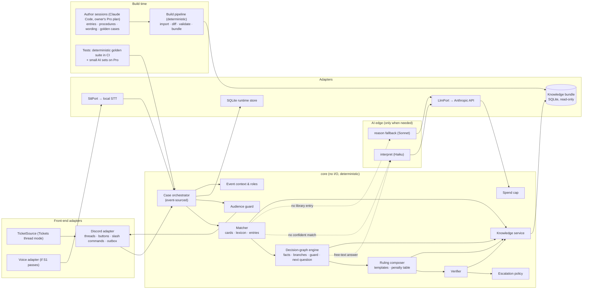

# AI MTG Judge: Architecture v1

Status: Proposed (PR `arch/v1`) · Date: 2026-09-25 · Author: architect role (Claude) · Approver: Frank (product owner)

This document turns [`docs/PRD.md`](../PRD.md) into a technical design. It does not change any requirement. Where the PRD is silent or unclear, or where the owner has asked for a change, the point is raised as an open question in PRD §12 (OQ-22 onwards). Decisions are recorded in [`adr/`](adr/README.md). The owner's answers from the architecture session are in [OWNER-ANSWERS.md](OWNER-ANSWERS.md). The other deliverables are:

- [SEQUENCE.md](SEQUENCE.md): one judge call, end to end;
- [SPIKES.md](SPIKES.md): the four technical spikes (S4 has been run; see [spikes/S4-report.md](spikes/S4-report.md));
- [TRACEABILITY.md](TRACEABILITY.md): every FR and NFR mapped to components.

## 0. The idea in one paragraph

**The judge is deterministic. AI sits only at its edges.**

- **Build time:** every ruling the judge can give is prepared as data and approved by the owner. It's a small decision graph: the facts that decide it, a pre-worded question for each fact, and an approved answer with citations for each branch. There are three kinds:
    - concept explanations ("what is priority?");
    - **answering strategies**: how a *kind* of rules question is answered for any cards with the right properties, for example "does tapping X trigger Kinnan?" (ADR-0017);
    - the investigation procedure for each infraction.
- **Card knowledge is prefetched:** each card's rules-relevant features, such as "is this ability a mana ability?", are computed at build time. A strategy can then answer about cards no scenario ever mentioned.
- **Strategies come from scenarios:** many scenarios are written in families, their proper answers are settled with the owner, and each family is abstracted into a strategy that must reproduce all of them.
- **Run time:** the judge matches the player's words to those entries (card names, keywords), asks the deciding questions as choices, and returns the approved answer. The penalty comes from a table lookup.
- **AI is called only** when a player's free text can't be matched, or when a rules question has no approved entry yet. That answer is then marked as not from the library, checked by the verifier, and logged so the entry can be added.

Most cases therefore use no AI, cost nothing, and give the same ruling every time.

## 1. Design drivers

| Driver | Source | What it forces |
| --- | --- | --- |
| Deterministic first, AI last; spend at build time | P2 | Answers, questions, penalties, fixes, and citations are approved data. At run time, AI only interprets unmatched free text and answers questions the library doesn't cover yet. |
| Deterministic questions (owner, 2026-09-25) | D29 / FR-INV-2, OQ-30 | The next question is chosen by the procedure, with pre-written, approved wording. Choices are asked as buttons where possible. |
| Library miss → AI answer, marked (owner, 2026-09-25) | FR-Q-1, FR-RUL-9 | A fallback `reason` path with a verifier, a visible marker, and a miss log that feeds the library |
| $0.05–0.10 per case, all in | NFR-COST-1 | Most cases are $0. AI calls happen only on the fallback paths. |
| 100% of easy cases correct; no invented citations; `UNRESOLVED` is valid | NFR-ACC-1..3, FR-RUL-9 | Approved answers are checked at build time. Fallback answers go through the verifier. |
| Multiplayer from day one | §4, R3 | Seats are an ordered list of N. Questions address roles (`activePlayer`, `opponentFurthestFromActive`). |
| Protected information | FR-ESC-4, D6 | Typed audiences; fixed templates; AI prompts get a player-safe projection only |
| Existing ticket bot (Tickets, in thread mode) | FR-INT-1, D37, R13 | A `TicketSource` plugin |
| Pick up tickets opened during an outage | NFR-AVAIL-1 | Event-sourced cases; reconciliation on startup |
| Don't rule out the phone app, WhatsApp, vision, on-device use, languages, or scale | D31, §4, NFR-EXT-1 | `core` emits front-end-neutral questions (choice, seat, number, text); a portable SQLite bundle; locale catalogs |
| Provider replaceable | D41, NFR-TECH-1 | `LlmPort`, used by two roles only |

## 2. Components



| Component | Package | Responsibility | ADR |
| --- | --- | --- | --- |
| **Discord adapter** | `adapters/discord` | Gateway; turns events into `InboundMessage{caseRef, author→seat, text | choice}`; renders core `Question`s as buttons, select menus, or text; slash commands; outbox with idempotency | 0010, 0011 |
| **TicketSource** | `adapters/discord/tickets` | Detect, parse, list, and track close/reopen of Tickets threads | 0010 |
| **Voice adapter** | `adapters/discord/voice` | Only if spike S1 passes | 0015 |
| **Case orchestrator** | `core/engine` | Case lifecycle (§5.1); folds `CaseEvent`s into state; per-case queue; catch-up | 0011 |
| **Normaliser** | `core/engine` | Turns typed or transcribed text into a structured `CanonicalQuestion`: text normalisation, slot extraction (cards with phonetic matching, seats, claims, intent), confidence scoring, and a read-back to the player. Uncertain slots become choice questions; AI (`interpret`) only fills leftovers from closed lists | 0018 |
| **Matcher** | `core/engine` | Finds the relevant graph deterministically: card resolver, concept/intent lexicon, then candidate `RulingEntry`s, `AnswerStrategy`s (through the mentioned cards' features), and `Procedure`s; asks a choice question when there are several candidates | 0005, 0008, 0017 |
| **Decision-graph engine** | `core/engine` | For the live entries and procedures: facts with origin, disputes, branch evaluation, next decisive question, the guard | 0008 |
| **Ruling composer** | `core/engine` | Fills the approved answer template for the selected branch; penalty from the table; fix steps from the branch; delivery pattern from the branch | 0008 |
| **Verifier** | `core/engine` | Deterministic checks. Trivial for library answers (checked at build time); essential for AI fallback answers (§5.6) | 0008 |
| **Escalation policy** | `core/engine` | FR-ESC-1 (a)–(e), handoff package, stop rule | 0008, 0009 |
| **Audience guard** | `core/engine` | Typed audiences, player-safe projection for AI prompts, output lint | 0009 |
| **Knowledge service** | `core/knowledge` | Read-only bundle queries: sections, cards, lexicon, entries, procedures, penalty table, templates, glossary | 0005–0007 |
| **Event context & roles** | `core/context` | Contexts, join codes, Admin → TO role mapping, permission checks | — |
| **Spend cap** | `core/cost` | Ledger of AI calls; monthly cap; questions-only mode at the cap | 0012 |
| **AI edge** | `adapters/anthropic` behind `LlmPort` | `interpret` (free text → structured) and `reason` (library miss → cited answer) | 0002 |
| **Stores** | `adapters/sqlite` | Runtime database, retention job | 0004 |
| **Author sessions** | Claude Code, owner's Pro plan | Write procedures, ruling entries, question wording, answer templates, lexicon entries, and golden cases; the owner approves each one | 0016 |
| **Build pipeline** | `pipeline` | Deterministic: import sources, diff, validate authored files, bundle, release report | 0007 |
| **Tests** | `eval` | Deterministic golden suite (CI, no AI); small AI sets (`interpret`, `reason` fallback) run on the Pro plan | 0013, 0016 |

**Dependency rule:** `core` depends only on port interfaces, and imports nothing from Discord, Anthropic, SQLite, or Node-only APIs (ADR-0001).

## 3. Data model

TypeScript-flavoured sketches: guidance for the planner, not a frozen schema.

### 3.1 Knowledge bundle (build time, read-only at run time)

```ts
// Sources (ADR-0007)
SourceDocument { docId, version, effectiveDate, origin, contentHash }
Section        { sectionId /* "CR:603.3b" */, docId, number, title?, text /* original */, searchText /* normalised */,
                 ruleKind /* definition|condition-effect|restriction|ordering|procedure|judgement */,
                 parentId?, refs[], textHash }                                                  // ADR-0007
OfficialRuling { oracleId, date, text /* Wizards, verbatim */, tags: { intents[], concepts[] } }  // answer source, ADR-0017 §5
Card           { oracleId, name, aliases[], typeLine, oracleText, faces?[], rulings[{date, text}], dataVersion }
CardFeatures   { oracleId, canBeCountered, abilities[{ kind, costHasTap, addsMana, targets: TargetSpec[],
                 isManaAbility, usesStack, triggerEvent?, effectKinds[], additionalEffects,
                 creates: Ability[] /* delayed triggers, emblems, granted abilities */ }],
                 derivation /* parser | ai-draft | reviewed */ }                                // prefetched, ADR-0017

// Shared decision-graph building blocks (ADR-0008)
FactSpec   { factId, valueType: "yesno"|"choice"|"seat"|"number"|"text", options?: OptionId[],
             askWho: RoleExpr /* "activePlayer", "controllerOf(trigger)", "allAtTable" … */,
             question: I18nKey /* pre-worded, approved */, whyItMatters: I18nKey,
             evidenceHint?, cheapToCollect: bool, derivedBy?: DerivationRule /* e.g. countOpponentsInGame */ }
Branch     { branchId, when: Predicate /* over facts */, answer: I18nKey /* approved template */,
             shortAnswer: I18nKey /* in-game minimum, FR-Q-5 */, chain: CitationStep[],
             fixSteps?: I18nKey[], penaltyRef?: {infractionId}, deliveryPattern?, escalate?: Reason }
CitationStep { source: SectionId | CardRef, proposition: I18nKey, consequence: I18nKey }   // PRD §8

// Rules questions: the approved rulings library
RulingEntry { entryId, kind: "concept"|"interaction", cards: OracleId[], concepts: ConceptId[],
              intents: IntentId[] /* "how-much-mana", "does-it-trigger", … */,
              facts: FactSpec[], branches: Branch[], mnemonic?: I18nKey /* FR-Q-4 */,
              sourceCases: GoldenCaseId[], approvedBy, approvedOn, derivation: "reviewed" }

// Rules questions, generalised: one strategy per kind of question (ADR-0017)
AnswerStrategy { strategyId, intent, appliesWhen: Predicate /* over card features + concepts */,
                 facts: FactSpec[] /* many derivedBy card features */, branches: Branch[] /* templates with {card} */,
                 derivedFrom: GoldenCaseId[], approvedBy, approvedOn }

// Disputes: one procedure per framework per infraction (FR-INV-1)
Procedure   { procedureId, frameworkId, infractionId, triggers: LexiconMatch[],
              facts: FactSpec[], branches: Branch[], integritySignals: Predicate[] /* OQ-14 */,
              stop: StopRule[], sourceSections[], approvedBy, approvedOn }
PenaltyRow  { frameworkId, infractionId, basePenalty, upgradePath?, sourceSections[] }   // FR-POL-1
PolicyFramework { frameworkId, baseDocs, addendum?, edits: AddendumEdit[] }            // OQ-20

// Matching and wording
Lexicon     { term /* "wheel", "tithe", "forgot my trigger" */, maps: {conceptId|intentId|infractionId|oracleId}, locale }
Template    { key: I18nKey, locale, text /* with {variables} */, approvedBy }          // ADR-0014
BundleManifest { bundleVersion, docs[{docId, version, hash}], cardData, precedence[] /* OQ-4 */, approvedBy, approvedOn }
```

An **answering strategy** is the general form: for example, "does tapping X trigger Kinnan?" decides on X's `isManaAbility` feature, and so covers Deathrite Shaman, Selvala, and every other card of that shape. `RulingEntry` remains for concepts and for genuine one-offs. A **concept** entry, such as priority, has no facts and one branch. An **interaction** entry has facts when the answer depends on game state. For example, Faerie Mastermind / Smothering Tithe / Orcish Bowmasters asks who is the active player and where each controller sits in turn order. A **procedure** is the same structure, plus a penalty, a fix, and integrity signals.

### 3.2 Event context and roles

```ts
EventContext { eventId, guildId, name, format: "cEDH", rel: "Competitive", frameworkId, language: "en",
               judgeRoleId, toRoleId, judgeOnlyChannelId, playerChannelIds[],
               ticketSource: { id: "discord-private-thread", config: { panelChannelId, ticketBotUserId } },
               joinCode,                                         // FR-CTX-4 (OQ-28)
               eventPolicies: EventPolicy[],                     // TO-set; amend tournament policy only (ADR-0020, OQ-35)
               escalation: { alwaysEscalate: CategoryId[] },     // OQ-7
               createdBy, updatedAt }
GuildRoleMapping { guildId, toRoleId, setByAdminUserId }        // FR-ADM-1
```

### 3.3 Case (runtime, event-sourced, 7-day retention)

```ts
Case          { caseId, eventId | null, containerRef, openedAt, closedAt?, status, systemVersion, bundleVersion }
Participant   { caseId, seat: "P1".."Pn" | "judge" | "to", discordUserId, isReporter }
Seating       { order: Seat[], activeSeat?, eliminated: Seat[] }        // only when a graph asks (FR-INV-3)
CaseEvent     { caseId, seq, at, type, payload, systemVersion, bundleVersion }     // ADR-0011
Candidate     { ref: entryId | procedureId, status: "live"|"dropped", reason }     // FR-RUL-6
Claim         { claimId, bySeat, kind: "event"|"state"|"assertion", text, via: "choice"|"normalizer"|"interpret" }  // FR-RUL-4
Fact          { factId, value, origin: "reported"|"observed"|"derived", basis, confirmedBy: Seat[] }
Dispute       { factId, versions[{value, bySeat[]}], status, judgementBasis? }     // FR-RUL-2
QuestionAsked { factId, candidateRefs[], whyItMatters, audience, askedSeat }        // FR-INV-2
Ruling        { outcome: "library"|"ai-fallback"|"unresolved"|"escalated", ref?, branchId?, text, chain[],
                penalty?: PenaltyRow & { label: "base, assuming no earlier infractions" }, fixSteps[], verifier }
InvestigationNote { signals[], inconsistencies[], suggestedQuestions[] }            // FR-ESC-4, staff-only
Handoff       { summary, established[], disputed[], citations[], provisionalReading, reason }   // FR-ESC-3
LibraryMiss   { caseId, question (pseudonymised), cards[], concepts[], aiAnswerRef }   // feeds the library
```

### 3.3b Canonical question

See ADR-0018. `CanonicalQuestion { raw, modality, cards[{oracleId, from, via, conf}], seats, intent, stated, claims, unresolved, confirmed }` is the only input the matcher sees. It is never rewritten prose.

### 3.4 Golden case

ADR-0013. A golden case holds the **raw player text**, the **scripted choices** for each fact, and the expected outcome in the same IDs (`entryId`/`procedureId`, `branchId`, `SectionId`).

## 4. Build time versus run time

| | Build time | Run time |
| --- | --- | --- |
| Where | The owner's desktop: Claude Code sessions plus the `pipeline` CLI | 24/7 on the owner's desktop |
| AI | **Author sessions** on the owner's Pro plan write entries, procedures, wording, lexicon terms, and golden cases. The pipeline code itself never calls a model. | Only `interpret` and the `reason` fallback, on API credits |
| Human step | The owner approves every entry, procedure, penalty row, and template (OQ-27), and approves the release (FR-BUILD-3) | Human judges take handoffs |
| Output | `knowledge-<v>.sqlite`, source diff, release report, stale-entry list | Case logs, messages, handoffs, library-miss log |
| Paid by | Pro subscription, no API spend (ADR-0016) | API credits, $20 a month cap |

**Pipeline:**

1. import the sources;
2. show the diff;
3. flag entries and procedures that cite a changed section as **stale**;
4. author sessions update the flagged items;
5. validate (schema; every citation resolves; every infraction has a penalty row per framework; every `FactSpec` has approved wording; every template variable is defined);
6. run the deterministic golden suite;
7. produce the release report;
8. the owner approves;
9. bundle.

**The scenario workshop** (ADR-0017) is the main build-time activity:

1. write scenarios in families with the owner;
2. settle their proper answers;
3. abstract each family into an `AnswerStrategy`, plus the card features it needs;
4. prove that the strategy reproduces every scenario in its family;
5. the owner approves it.

Card features are prefetched: the deterministic Oracle parser first, then author sessions tag the rest. Each `LibraryMiss` from the live bot, and each exported case, becomes a new scenario. So the library grows by strategies, not by single card pairs.

## 5. Runtime behaviour

### 5.1 Case lifecycle

```mermaid
stateDiagram-v2
  [*] --> Detected: Tickets thread found
  Detected --> Narrating: greeting + "tell me what happened, step by step" (ADR-0019)
  Detected --> Matching: opening text already contains a question (skip)
  Narrating --> Narrating: follow along silently; volunteer check
  Narrating --> Matching: a question is formulated / arises / silence prompt answered
  Matching --> Matching: ask a choice (which card / which question / what kind of help)
  Matching --> Answering: rules question → entry found
  Matching --> Fallback: rules question → no entry
  Matching --> Investigating: dispute → procedure(s) found
  Matching --> Escalated: dispute → no procedure
  Answering --> Answering: ask a deciding fact of the entry
  Answering --> Delivered: approved answer
  Fallback --> Delivered: AI answer, verified, marked
  Fallback --> Escalated: verifier fails / unresolved
  Investigating --> Investigating: next decisive question
  Investigating --> Confirming: guard passes (FR-RUL-5)
  Confirming --> Investigating: "something's wrong"
  Confirming --> Delivered: ruling + penalty + fix
  Investigating --> Held: integrity stop rule
  Held --> Escalated
  Delivered --> Escalated: player taps "ask a human judge" (FR-ESC-1c)
  Delivered --> Closed
  Escalated --> Closed
  Closed --> [*]
```



**Narration intake (ADR-0019):** unless the opening text already contains a question, the judge asks the caller (or an agreed volunteer) to tell what happened, step by step. It follows along without interrupting, and ends narration when a question is formulated or arises, or after silence ("So, what is your question?" / "So, how can I help you?", chosen by tone).

**No event context on the server (FR-CTX-2):** only rules questions are answered. A dispute gets a template reply saying the judge can't rule here, and that a human judge should be called.

### 5.2 Matching (deterministic first)

Matching runs on the **canonical question** produced by the normaliser (ADR-0018), after the player has confirmed the read-back.


1. **Card resolver** (ADR-0005): exact, then normalised, then fuzzy card names found in the text. More than one plausible card gives a choice question: "Did you mean [Kinnan, Bonder Prodigy] [Kinnan, …]?" (FR-Q-2).
2. **Lexicon:** player vocabulary ("wheel", "tithe", "forgot my trigger", "what is priority") is mapped to concepts, intents, and infractions. The lexicon is authored and approved at build time, and grows from `LibraryMiss` logs.
3. **Candidates:**
    - rules questions look, in this order, for:
        - `RulingEntry`s whose cards ⊆ the mentioned cards and whose concepts or intents match;
        - an **official card ruling** of those cards tagged with the matched intent, quoted and attributed;
        - `AnswerStrategy`s whose `appliesWhen` holds for the mentioned cards' **prefetched features** and the matched intent. Strategies may call **rule modules** (tested functions for rule areas such as targeting, mana abilities, APNAP) whose outputs become derived facts (ADR-0017 §5–6);
    - disputes look for `Procedure`s whose triggers match, in the event's framework.
4. **Outcome:**
    - one candidate: proceed;
    - several: ask a choice question listing them, in plain words from their templates;
    - none: call **`interpret`** (Haiku) on the text, which maps the free text onto the closed lists of cards, concepts, intents, and infractions, then match again.

   Whether a case is a rules question or a dispute is decided the same way. If it's unclear, a choice decides it: "What can I help with? [A rules question] [Something happened in the game]".
5. **Still nothing:**
    - a rules question goes to the **`reason` fallback** (§5.3);
    - a dispute is escalated with the facts gathered so far (FR-ESC-2).

### 5.3 Rules questions (FR-Q-1..5)

**Library hit:**

- the engine asks the entry's deciding facts, if any (for example "Whose turn is it? [P1] [P2] [P3] [P4]"), then returns the branch's approved **short** answer during a game (FR-Q-5). The mnemonic comes first where the entry has one (FR-Q-4);
- two buttons follow: [Why?] shows the full answer and the citation chain; [Ask a human judge];
- there is no AI call.

**Library miss (owner, 2026-09-25):**

- `reason` (Sonnet) receives only the retrieved sections, Oracle text, and rulings (ADR-0005), and may cite only those IDs;
- the verifier runs (§5.6);
- the answer is shown with a **marker**, a template such as *"This answer was worked out for this question and hasn't been reviewed yet"*;
- the case writes a `LibraryMiss`, which becomes a library candidate;
- if the verifier fails, the answer is `UNRESOLVED` and escalated (FR-RUL-9).

**MTR procedure questions** ("how many points is a draw worth?") are ordinary library entries citing the MTR or addendum. They are never applied to event data (FR-Q-3, NG1).

### 5.4 Disputes: deterministic investigation

See ADR-0008.

- The engine keeps every matching procedure **live** (FR-RUL-6). Each turn it computes the **decisive unknown facts**: the ones whose value would change the branch, penalty, fix, or escalation.
- It asks one of them, choosing by the procedure's stated priority order, then by which fact splits the live branches most evenly.
- Each question uses its approved wording, is addressed to the `askWho` role, and is rendered as buttons where the value type allows. The question is logged with `whyItMatters` (FR-INV-2).
- A **typed answer** instead of a button goes through a deterministic normaliser (yes/no, numbers, seat mentions). Only if that fails does `interpret` map it onto the fact's options.
- **The guard** allows a ruling only when exactly one branch is true and no decisive fact is unknown. Before that, **confirming** shows a template summary of the established facts with [That's right] [Something's wrong] (FR-RUL-5).
- **Contradictory answers** from different seats open a `Dispute`:
    - if both versions select the same branch, it's immaterial, and the judge rules on the agreed facts;
    - otherwise it asks the procedure's follow-up question, or escalates (FR-RUL-2, FR-ESC-1e).

Two golden scenarios show how this plays out:

- **Wheel of Fortune / Flare / Smothering Tithe:**
    - "28 missed triggers" is a `Claim{assertion}`, not a fact;
    - the trigger count is a `derived` fact (`derivedBy: countOpponentsInGame`);
    - the Missed Trigger procedure's branches depend on `stackBecameEmpty`, so the judge asks exactly that: "After the triggers were missed, did the stack become empty at any point? [Yes] [No] [Not sure]".
- **The One Ring / Carpet of Flowers:**
    - the Missed Trigger branch follows from the game actions;
    - the procedure's **integrity signal** (a player invoked an effect after letting an action it would have prevented go ahead) opens a staff-only note, and questioning stays neutral;
    - the explanation lowers the signal but doesn't change the branch (FR-RUL-6 AC, FR-RUL-7).

### 5.5 Penalties (FR-POL-1..3)

- The penalty is a `PenaltyRow` lookup. For the FR-POL-1 AC, the MTRA rows replace Game Loss with Turn Skip.
- Every penalty is labelled as the base penalty, assuming no earlier infractions, and copied to `Staff` (FR-POL-3).
- The **delivery pattern** (FR-POL-2) is set on the branch at build time and approved with it. Golden cases check it.

### 5.6 Verifier

| Check | Applies to | Requirement |
| --- | --- | --- |
| Every citation resolves in the loaded bundle | build time for library answers; every fallback answer | NFR-ACC-3 |
| Fallback answers cite only IDs from their retrieval set | fallback | §5, NFR-ACC-3 |
| Penalty = table lookup; fix = branch steps | disputes | FR-POL-1 |
| Every decisive fact of the chosen branch is established | disputes, entries with facts | FR-INV-2, FR-RUL-2 |
| No `assertion` claim is used as a fact | all | FR-RUL-4 |
| Output lint: protected terms, hidden information, play-advice phrases | fallback text and filled templates | FR-ESC-4, FR-RUL-8 |
| Glossary terms kept in English | all | NFR-I18N-1 |

## 6. Escalation, handoff, and protected information

- **FR-ESC-1:**
    - (a) replaced by concrete signals, because a deterministic ruling has no "confidence": an unresolved dispute, a verifier failure, a fallback marked `UNRESOLVED`, or a dispute with no procedure (OQ-7);
    - (b) `alwaysEscalate` categories;
    - (c) the **[Ask a human judge]** button under every ruling and answer, or typed text that `interpret` recognises as a contest, confirmed with a button;
    - (d) the integrity stop rule;
    - (e) an open decisive dispute.
- **Event-management consequences** (a drop from the event, re-entry, result changes) are **referred to the TO** in the judge-only channel, never announced by the judge, unless a TO-set event policy covers the case, which the judge applies and cites (ADR-0020).
- **FR-ESC-2:** before handing off, the engine asks the remaining `cheapToCollect` questions (except under an integrity stop).
- **FR-ESC-3 / FR-ESC-5:** the handoff package goes to `Staff`; players get a fixed template.
- **FR-ESC-4 / ADR-0009:**
    - notes are staff-only and are produced from procedure signals;
    - player text comes from fixed templates, or from AI prompts that see only a player-safe projection;
    - the output lint runs on everything sent to players.
- **Human takeover:** after escalation the bot stays quiet in the thread unless a judge invokes it, and it keeps recording.

## 7. Hosting and deployment

See ADR-0003.

- **Host:** the owner's always-on desktop (i9-10900, 32 GB, RTX 2070 SUPER), on Windows 10 Home. The end of its security updates is accepted as a risk for the pilot.
- **Runtime:** Docker Compose if CPU virtualization can be switched on; otherwise a Windows service. Outbound connections only.
- **Releases:** code by a git tag and redeploy; a knowledge bundle by copying the approved file and restarting the bot. Open cases resume from their log, and each keeps the bundle version it started with (NFR-VER-1).
- **Observability:** logs, plus a daily owner-channel summary: cases, library hit rate, library misses, escalations, AI spend.

## 8. How the long-term vision stays open (D31, §4)

| Future capability | What keeps it possible |
| --- | --- |
| Phone app, web, WhatsApp | `core` emits neutral `Question{valueType, options}` and `Outbound{audience}`. Each front end renders them its own way: buttons, a numbered list, or speech. |
| Voice (phone, several players at one device) | Voice has no buttons, so `interpret` is used more often. It is the same edge. |
| Photo, video, streams | `Evidence` + `Fact{origin: observed}`; procedures carry `evidenceHint` |
| On-device use | The bundle is a portable SQLite file, and the deterministic core needs no model at all. Only misses need AI, which could later be on-device. |
| Other languages | Templates and lexicon are per locale (ADR-0014); rulings are data, not prose generated at run time |
| 1v1, JAR, Limited | Format, REL, and framework are IDs; new procedures and entries are data |
| Penalty history | `PenaltyRow.upgradePath` is data; add a history store later |
| Very large scale, 10k+ corpus | Deterministic lookups scale cheaply; PostgreSQL behind the repository ports; cases partitioned by ID |

## 9. Cost model at pilot volume

AI calls happen only on the edges. Prices: Haiku 4.5 $1/$5, Sonnet 5 $2/$10 per million input/output tokens.

| Path | AI calls | Cost |
| --- | --- | --- |
| Rules question, library hit | none | $0 |
| Rules question, library miss | 1 `interpret` + 1 `reason` | about $0.03–0.04 |
| Dispute, answered by buttons | none, or 1 `interpret` for the opening description | $0–0.01 |
| Dispute with free-text answers | 1–3 `interpret` | about $0.01–0.03 |

The biggest unknown is the **library hit rate**. It starts low and grows as scenario families become strategies. Because a strategy covers every card with the right features, the rate should climb much faster than with per-combination entries (ADR-0017). Using the owner's 75/25 mix of questions to disputes:

| Library hit rate | Cost per case | 200 cases/month | 430 cases/month |
| --- | --- | --- | --- |
| 20% (early) | about $0.025 | about $5 | about $11 |
| 50% | about $0.017 | about $3.50 | about $7.50 |
| 80% | about $0.009 | about $2 | about $4 |

(Assumptions: a miss costs $0.035 and a dispute averages $0.015.)

Hosting and speech-to-text add $0 (ADR-0003, ADR-0015). Every case fits NFR-COST-1. The spend cap (ADR-0012) is a safety net, not a routing mechanism.

**Build and test** cost $0 in paid spend (ADR-0016). The golden suite is deterministic and runs in CI with no AI. Only two small sets use AI, on the Pro plan: `interpret` (free text → structure) and `reason` (fallback questions).

## 10. Security and privacy (NFR-PRIV-1, D39)

- **Data minimisation:** AI calls happen only on the edges, and carry seat labels instead of Discord identities.
- **Retention:** 7-day deletion; backups rotate within the same window; `LibraryMiss` records are pseudonymised.
- **Deletion on request:** an Admin command.
- **Third-party processor:** accepted by the owner (OQ-23). A short privacy notice for players is recommended.
- **Voice:** consent per player per event, a listening window only, audio never stored (ADR-0015).
- **Authorisation:** TO and Admin checks on every command; the Admin is a configured user ID; FR-LOG-2 is enforced on every read.
- **Secrets:** an env file on the host. The API key exists only in the bot's environment.

## 11. Risks

| Risk | Mitigation |
| --- | --- |
| Library coverage is low at launch, so many questions fall back to AI | The fallback is marked and verified; the miss log feeds new entries; hit rate is reported daily |
| A wrong prefetched card feature makes every answer about that card wrong | Features used by strategies are reviewed; `ai-draft` features can be excluded per strategy; [Why?] shows the feature ("not a mana ability, CR 605.1a"); stale flags on Oracle/CR changes (ADR-0017) |
| Matching picks the wrong entry for a question | Cards must be mentioned; ambiguity gives a choice; [Why?] shows the reasoning; [Ask a human judge] is always there; matching is tested on held-out raw texts |
| A wrong entry or procedure gives the same wrong ruling every time | Owner review of every entry; golden variants per branch; stale flags on source changes |
| Review load (R12) | Entries are small; most come from cases the owner already validated |
| Scenarios a strategy was derived from would test themselves | Held-out scenarios use other cards and phrasings, so they measure whether strategies generalise (ADR-0013, ADR-0017) |
| Home-host outage | Catch-up on restart (ADR-0011) |
| Host OS without security updates (accepted for the pilot) | Outbound-only, 7-day retention, secrets readable only by the owner (ADR-0003) |
| Discord voice receive unsupported | Isolated adapter; spike S1 (R4) |
